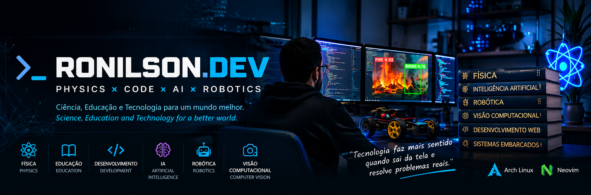

<p align="center">
  
</p>

<h1 align="center">👋 Olá, eu sou Ronilson Lima Souza</h1>

<h3 align="center">
  ⚛️ Physics • 💻 Code • 🤖 Robotics • 👁️ Computer Vision
</h3>

<p align="center">
  <b>Físico • Professor • Desenvolvedor • Maker</b><br>
  <i>Physicist • Educator • Developer • Maker</i>
</p>

<p align="center">
  📍 Imperatriz, Maranhão, Brasil
</p>

---

## 👨‍🚀 Sobre mim / About me

Sou **professor de Física e Robótica, pesquisador e desenvolvedor**, interessado na interseção entre **Ciência, Educação e Tecnologia**.

Tenho **12 anos de experiência na educação** e gosto de transformar problemas do cotidiano em projetos práticos utilizando programação, inteligência artificial, visão computacional, robótica e desenvolvimento web.

Atualmente, meu principal campo de estudo é a aplicação de **Visão Computacional à Robótica**, especialmente em sistemas capazes de perceber, interpretar e interagir com o mundo real.

Também desenvolvo ferramentas de automação e aplicações web voltadas para problemas reais encontrados no ambiente educacional.

> **"Tecnologia faz mais sentido quando sai da tela e resolve problemas reais."**
>
> *"Technology makes more sense when it leaves the screen and solves real-world problems."*

---

## 🎓 Formação / Education

- 🔬 **Mestre em Ciência dos Materiais — UFMA**
  - Pesquisa envolvendo materiais magnéticos e magnetocalóricos

- ⚛️ **Licenciatura Plena em Física — IFMA**

- 🤖 **Especialização em Robótica Educacional — UNIMINAS**

- 💻 **Ciência da Computação — UNINTER**
  - Atualmente no **5º período**

---

## 🎯 Principais interesses / Main Interests

- 👁️ **Visão Computacional / Computer Vision**
- 🤖 **Robótica / Robotics**
- 🧠 **Inteligência Artificial / Artificial Intelligence**
- 🌐 **Desenvolvimento Web / Web Development**
- ⚙️ **Automação / Automation**
- 🔌 **IoT & Sistemas Embarcados**
- 🎓 **Tecnologia Educacional / Educational Technology**

---

## 🔥 Projeto em destaque / Featured Project

### 🔥 Detector de Fogo e Fumaça

Projeto de **Visão Computacional utilizando YOLO e OpenCV** para identificação de fogo e fumaça em imagens e vídeo.

O projeto combina **pesquisa, desenvolvimento de software e aplicação prática de Inteligência Artificial**, buscando explorar sistemas de monitoramento capazes de auxiliar na identificação automática de possíveis focos de incêndio.

**Tecnologias:**

`Python` • `YOLO` • `OpenCV` • `Computer Vision` • `Deep Learning`

---

## 🚀 Outros projetos / Other Projects

### ⚙️ Automação

Desenvolvimento de ferramentas em **Python** para automatizar tarefas repetitivas, manipulação de dados e interação com aplicações web.

`Python` • `Playwright` • `OpenPyXL`

### 📜 Gerador de Certificados

Aplicação web para criação de certificados personalizados a partir de dados CSV/TXT, com geração de arquivos em diferentes formatos.

`HTML` • `CSS` • `JavaScript`

### 🤖 Robótica Educacional

Desenvolvimento de projetos utilizando **Arduino, sensores, motores, comunicação Bluetooth, impressão 3D e programação**, incluindo aplicações voltadas à educação e futebol de robôs.

`Arduino` • `C++` • `Electronics` • `3D Printing`

### 🖥️ Projetos Web

Desenvolvimento de aplicações e ferramentas web para resolver problemas relacionados à educação, automação e produtividade.

---

## 🛠️ Tecnologias / Tech Stack

### Linguagens

<p>
  
</p>

### Inteligência Artificial & Visão Computacional

<p>
  
</p>

`YOLO` • `Computer Vision` • `Deep Learning`

### Hardware & Robótica

<p>
  
</p>

`Arduino` • `Electronics` • `Sensors` • `Robotics` • `3D Printing`

### Ferramentas

<p>
  
</p>

---

## 🐧 Linux

Meu primeiro sistema Linux foi o **Arch Linux**.

Escolhi o Arch justamente por sua reputação de ser uma distribuição que exige maior envolvimento do usuário com o sistema.

O que começou como um desafio acabou se tornando parte importante da minha jornada na computação.

Uso Linux há aproximadamente **7 anos** e atualmente o **Arch Linux é meu sistema principal**.

```bash
$ whoami
ronilson

$ cat interests.txt
Physics
Computer Vision
Robotics
Artificial Intelligence
Web Development
Linux
